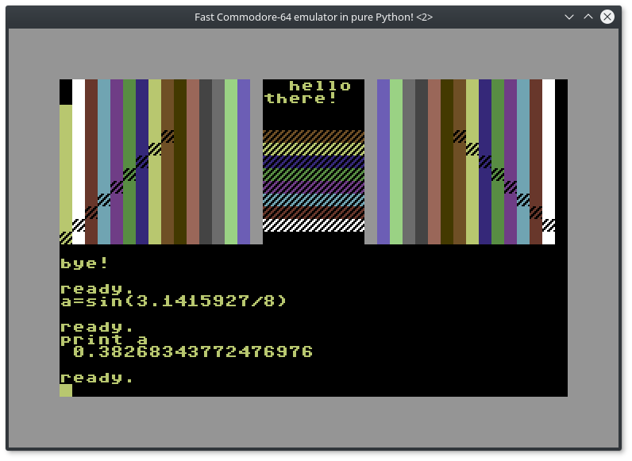
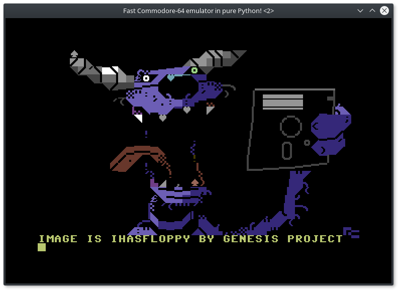
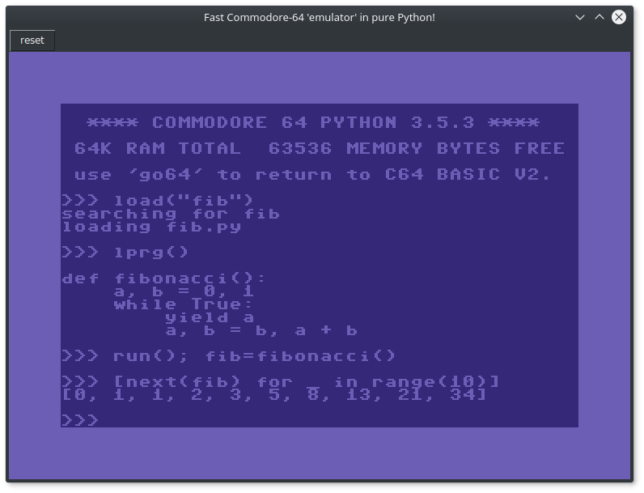

# pyc64: Commodore-64 "emulator" in pure Python!

... Or is it?

Well, it emulates the character mode quite well and thus you can display pretty PETSCII pictures if you want.
A few demo programs are included.

A subset and variant of the BASIC V2 in the C-64 is working.
Some VIC-II registers are also working:

- 53280 and 53281 screen and border colors ($d020/$d021)
- 646 cursor color ($0286)
- 1024-2023 the screen buffer characters ($0400-$07e7) 
- 55296-56295 the screen buffer colors ($d800-$dbe7)
- sprites! (no multicolor though, and no priority register and collision detection)
- and some others, see the implementation of the ``execute_poke`` method.

A few function keys are remapped as wel for convenience, like the fastloader cartridges of old:

- F1 = LIST:
- F3 = RUN:
- F5 = LOAD shortcut
- F6 (shift-F5): LOAD "*",8  shortcut
- F7 = DOS"$ to show directory of drive8

Note that most of the BASIC operations are essentially handled by Python itself via eval(),
so you can do many interesting things that are silly to see working on a classic 80's c-64 screen.
For instance, try ``print 5**123``  or ``print sys.platform`` or ``print sum(log(x) for x in range(1,10))``

Note that it is not supported to do any blocking operation such as INPUT or WAIT.
However, GET is supported (which gets one keypress from the keyboard buffer)
So simple interactive programs can be created.

Enter the 'gopy' command to switch to a Python REPL, and use 'go64' to switch back to BASIC.

You'll need the [pillow](https://pillow.readthedocs.io) library because 
the program needs to do some charset bitmap conversions at startup for tkinter.

Python mode:

